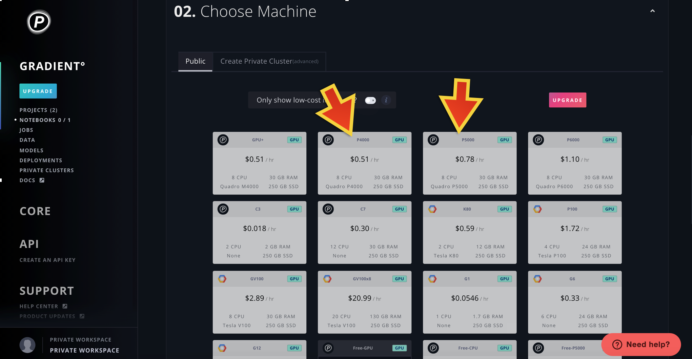

# Uploading data to Paperspace

Just as an aside, there are multiple datasets that are publicly available in Paperspace. They are located in the `/datasets` folder, and can be accessed in any project. A list of these datasets (and a brief description of them) is found 
[here]: https://docs.paperspace.com/gradient/data/public-datasets-repository

The simplest way to upload datasets (or code) from your local computer to Paperspace is using a Gradient Jupyter Notebook. 

Persistent Storage

Anything you store in `/storage` directory will be accessible across multiple runs of Jobs and Notebooks in a given storage region.

(1) After logging into Paperspace, toggle your mouse to the Gradient section (in the left hand column of the Paperspace consule) to see the drop down menu of Gradient options. Select Notebooks (second option) to access the control console for jupyter notebooks. 

(2) Next you need to create a notebook. This is done by selecting the bright seafoam green button in the middle of the right hand side of the Notebook console. 

You will be prompted to select a container (which sets up the operating system/environment in which to run the notebook). For uploading data you don't need anything in particular, so select the first option, titled fast.ai. 

You then need to scroll down the page and select the type of machine/computer you would like to run your notebook on. It is recommended to select P4000 or P5000 (the second or third option in the first row). 

Scroll down again to the section Notebook options. It is highly recommended to set a time limit upon your notebook; if you forget to stop the notebook, you will get charged for it! Scroll to the very bottom of the page, and select the dark teal +Create Notebook button.
This action creates a separate web page that is running the notebook instance.

(3) Toggle to the separate web page where your notebook is running. Under the files tab, you can view the file system of you Paperspace server. These of the files that all of your projects/jobs can access. The `/datasets` folder holds all of the public datasets mentioned above, where as `/storage` is your persistent storage space, which means that anything you upload there will 'persist' across jobs, experiments, and projects. Note that you will be charged for the amount of storage space you use. To upload a dataset from your local computer, you first need to zip the dataset locally. You then can upload it by selecting the Upload button on the right hand side of the console. This will prompt you to select a file to upload from you local file system. Once you have selected your zipped dataset, make sure to hit the blue upload button next to your zipped filename to complete the upload.

(4) Now that your zipped file is uploaded into Paperspace, you need to unzip it. An easy way to do this is to upload the `unzipfile.sh` script provided in this repository. Once that script is uploaded, select the New button (next to the upload button) and select Terminal from the dropdown menu. This will take you to a terminal for the notebook. If you typw `ls`, in the command line, you can view the files/folders. To unzip your dataset, type `bash unzipfile.sh <yourdatasetfilename.zip>`, or `bash unzipfile.sh storage/<yourdatasetfilename.zip>` if you placed your dataset into persistent storage, and hit the enter key. There will a large text output to the terminal screen once the script is running. Once it is finished, you can hit the back button on your browser to return to the notebook filesystem, where you can view the unzipped dataset. 

