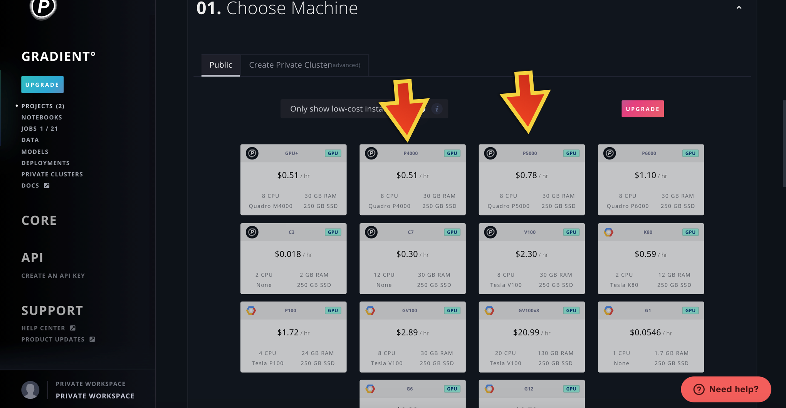
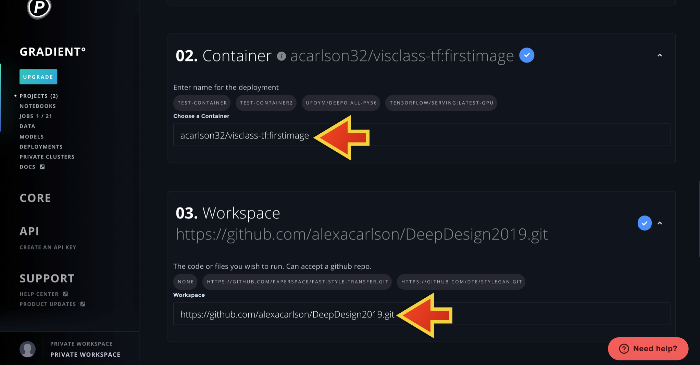
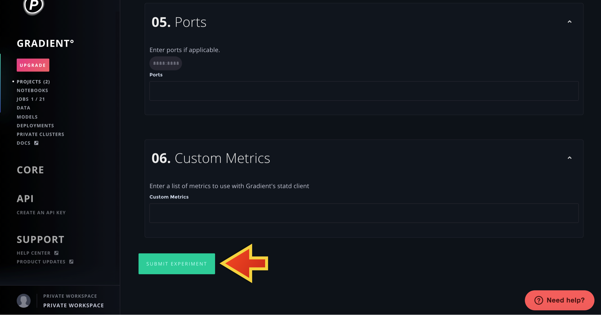

# Executing Models using Paperspace Gradient Experiment Builder
The Paperspace Experiment Builder is a wizard-style UI tool to submit a job. You can use it for both training and testing models.  

After signing in, click on Gradient in the navigation bar on the left to choose `Projects`. This takes you to the Projects console.

Click on the `+ Create Project` button and select `Create Standalone Project`. This generates a white popup screen that guides you through the different options for setting up your Project. Enter a name for the project when prompted. 

Once you have created a Project, it will appear at the bottom of the Projects console. All of your Projects (and basic information about how many experiments you have in your project, recent activity, etc) will appear here. 
Select a project to enter its console. In the depicted example, we enter the testcode project console.

Now that you are in in the Project console, select the light blue `+ Create Experiment` button on the right hand side of the Project console.This takes you to a new page, where you will step through various options to set up your Experiment. Note that at the bottom of the page, information about each experiment in this specific Project is listed. You can select any experiment to find out more specific information about the command used to start the experiment, the code used to run it, as well as logs regarding the code output and any error logs if the code fails to run.

The first section to appear allows you to choose the provided paperspace sample examples; scroll past this to section 01 (unless you would like to run through those). 
The first step is to choose a machine type for scheduling the Experiment. For the code in our DeepDesign github repository, you can choose either the `P4000` or `P5000` machine types. However, depening on the size of your inputs and outputs, you may need to select a machine type with more RAM (or random access memory; this is similar to working memory for humans, and defines how much memory the machine has to 'solve the problem' with the information you input to it).

Scroll to section 02, where you will input a docker container image to use. This sets up the computing environment that will be run on the machine you chose in the previous section. The best way to understand a container image is that it is a blueprint that defines all the software dependcies that your code will need to run successfully. Below section 02 ia section 03, where you select the Experiment Workspace. This is the code you wish to run, which is in our DeepDesign github repository! Therefore we can input in the url to our repo. This is what is super powerful about the Gradient Experiment builder; you can run any code in any github repository!

Finally, scroll to section 04. This is where you define the command for the job which is the Python script that executes within the context of the container. When the script exits gracefully, the job is marked as complete. If an error is thrown, the job is marked as failed. You can access this information by selecting the experiment on the Project page once the experiment has been submitted.

Scroll past section 05 and 06. We are now ready to kick off the training job by clicking on the Submit Experiment button at the bottom of the page. Gradient adds the job to the queue and schedules it in one of the chosen machine types. 

## git repo
https://github.com/alexacarlson/DeepDesign2019.git

## Running 2D deep dream

2D deep dream Docker image:

`acarlson32/visclass-tf:firstimage`

Command Format:
`bash run_2Ddeepdream_eval.sh IMAGE_DATA WEIGHTS_DIR DREAM_CLASS RESULTS_DIR NUM_ITERS`

Command Example:

`bash run_2Ddeepdream_eval.sh /storage/2Dmodels/scene0_camloc_0_5_-20_rgb.png /storage/acadia_general_arch_styles_netweights gothic /storage/test 500`

## Running 2D style transfer

2D style transfer docker image:

`acarlson32/neuralstyle-tf:firstimage`

Command Format:

`bash run_2Dneuralstyletransfer.sh CONTENT_FILE STYLE_FILE OUTPUT_FILE IMAGE_SIZE CONTENT_WEIGHT STYLE_WEIGHT`

Command Example: 

`bash run_2Dneuralstyletransfer.sh /storage/2Dmodels/robotics_building_satellite.png /storage/2Dmodels/new000343.png /artifacts/roboticsbuilding_satellite_style000343_styleweight10.jpg 500 5.0 1.0`

## Running 2D to 3D neural renderer

Neural Renderer docker image:

`acarlson32/2d3d_neuralrenderer:firstimage`

Command Format:

bash run_2Dto3Ddeepdream.sh /storage/3Dmodels/bench.obj 3Ddreamed_bench.gif /artifacts/results_3D_dream 300

bash run_2Dto3Dstyletransfer.sh /storage/3Dmodels/TreeCartoon1_OBJ.obj /storage/2Dmodels/new000524.png 2Dgeo_3Dtree.gif /artifacts/results_2D_to_3D_styletransfer

bash run_2Dto3Dvertexoptimization.sh /storage/3Dmodels/TreeCartoon1_OBJ.obj /storage/2Dmodels/new000524.png 2Dgeo_3Dtree /artifacts/results_vertoptim 250
